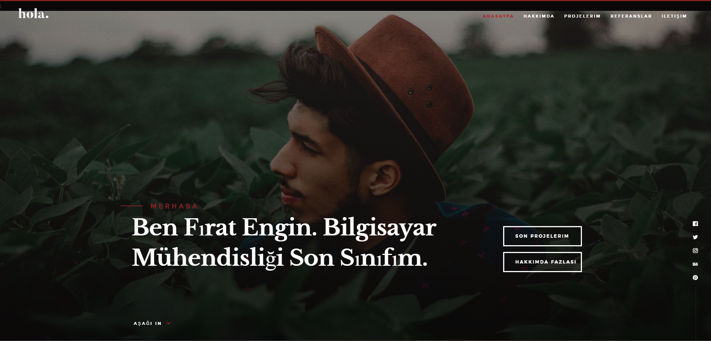
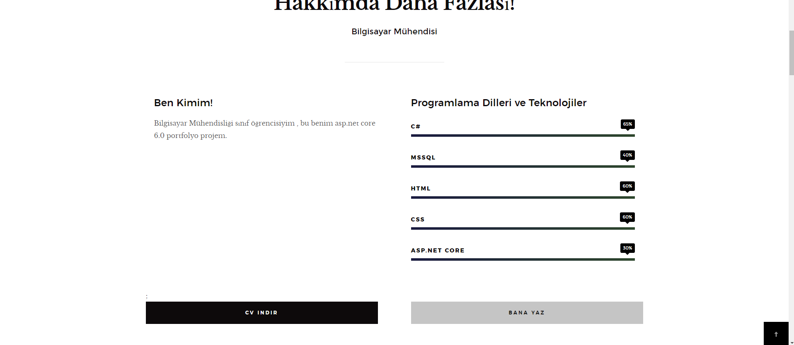
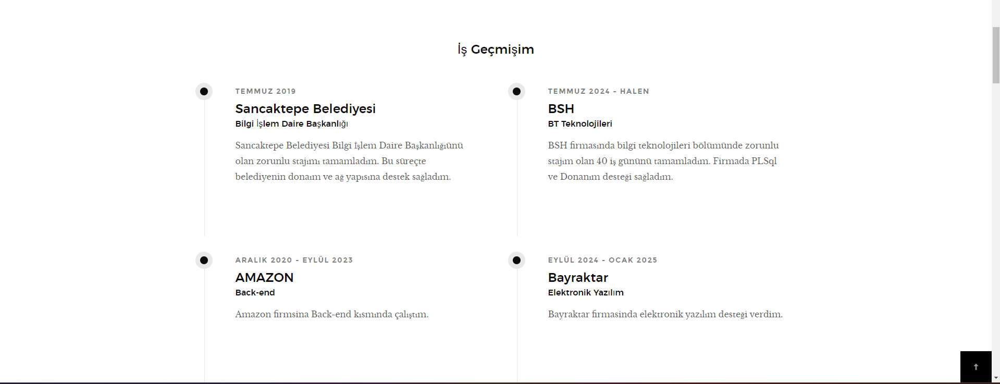
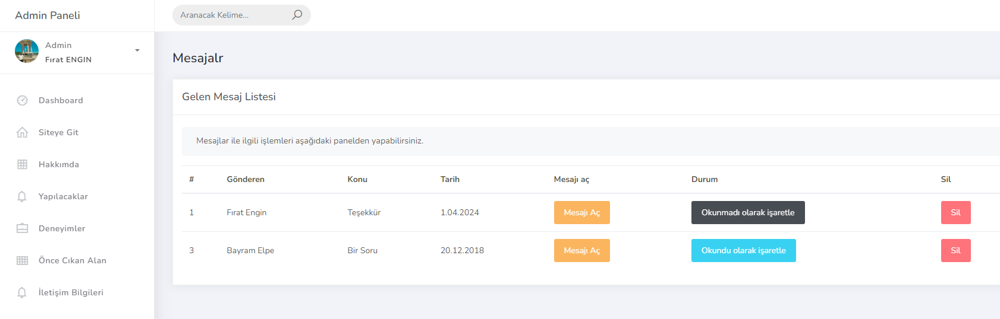
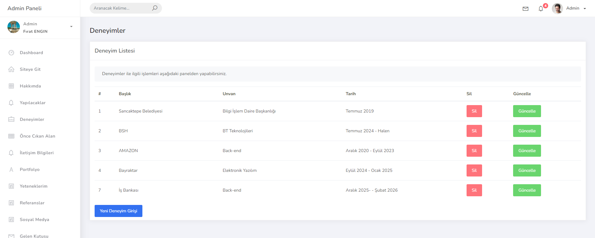

# Dinamik Portfolyo Uygulaması

## 🎯 Amaç
Bu projede, **ASP.NET Core** kullanarak sıfırdan bir portfolyo uygulaması geliştirdim. Amacım, modern web uygulama geliştirme tekniklerini uygulamalı olarak öğrenmek ve dinamik veri yönetimini başarılı bir şekilde sağlamak oldu.

## 📋 Gereksinimler
Projeye başlamadan önce, temel düzeyde **C#** bilgisine sahip olmanız, projeyi daha kolay ve anlaşılır bir şekilde tamamlamanıza yardımcı olacaktır.

## 📑 Senaryo Kurgusu
Projemde, bir portfolyo teması üzerinden **SQL Server** veri tabanını kullanarak aşağıdaki verilerin dinamik yönetimini sağlıyorum:

- **Hakkımda**
- **Deneyimlerim**
- **Yeteneklerim**
- **Referanslarım**

- **İletişim Bilgilerim**

## 🔧 Teknik İçerikler
Projede kullandığım başlıca teknolojiler ve kavramlar:

- **ASP.NET Core**
- **SQL Server**
- **Context Sınıfı ve Migration İşlemleri**
- **Paket Yönetimleri**
- **HTML, CSS, Bootstrap, JavaScript**
- **View Component, Model, View, Controller**

## 📚 Parta Dair
Projem iki ana parçadan oluşmaktadır:

- **Kullanıcı Arayüzü (UI)**: Projemizin web arayüzü, kullanıcı deneyimini optimize etmek için tasarlandı.
- **Admin Paneli**: Projenin yönetim tarafı, veri giriş ve düzenlemeleri için kapsamlı bir panel içerir.

